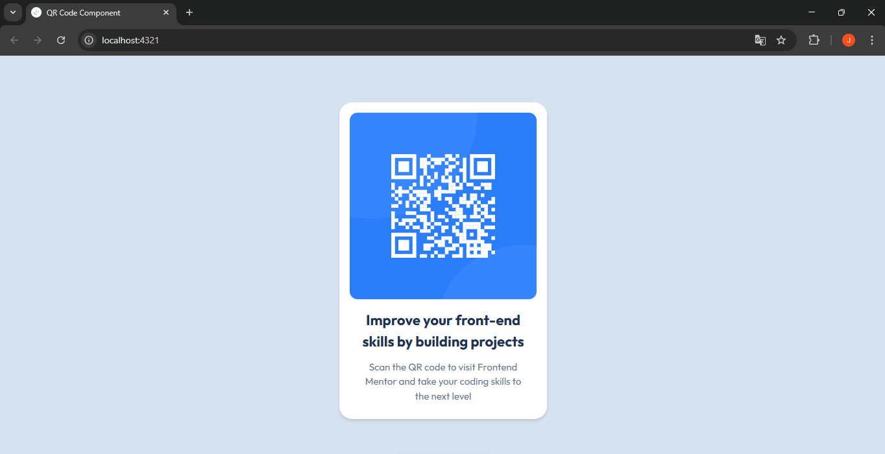

# 🧩 Proyecto: Componente QR Code

Este proyecto consiste en el desarrollo de un **componente de Código QR** utilizando **Astro** y **Tailwind CSS**.  
El objetivo es aplicar los conocimientos sobre **componentes**, **maquetación**, **estilos responsivos** y **utilidades CSS** para construir un diseño limpio, moderno y adaptable a diferentes dispositivos.

---

## 📖 Descripción general

### 🧩 Vista previa del proyecto



---

### 🔗 Enlaces del proyecto

- **Repositorio en GitHub:** https://github.com/Jaqui0306/QR_Code_Component
- **Sitio desplegado (opcional):** [Agrega aquí la URL del proyecto desplegado, si usaste Vercel o Netlify](https://)

---

## 🧠 Proceso de desarrollo

### 🛠️ Tecnologías utilizadas
- Astro para la creación de componentes y estructura del proyecto.
- Tailwind CSS para aplicar estilos rápidos y responsivos.
- HTML5 semántico para estructurar correctamente el contenido.
- Diseño responsivo (Mobile-first) para que el componente se adapte a diferentes tamaños de pantalla.
- Componentes reutilizables para organizar mejor el código.

---

### 💡 Lo que aprendí
Durante el desarrollo de este proyecto aprendí a crear y utilizar componentes en Astro, así como a aplicar estilos utilizando Tailwind CSS para diseñar interfaces de manera más rápida. También reforcé mis conocimientos sobre estructura HTML semántica, alineación de elementos, espaciado, y diseño responsivo para que el componente se vea correctamente tanto en dispositivos móviles como en computadoras.

Código utilizado en el proyecto fue el siguiente:
```html
<div class="bg-white p-4 rounded-xl shadow-lg text-center">
  
  <h1 class="text-lg font-bold">
    Improve your front-end skills by building projects
  </h1>
  <p class="text-gray-500 text-sm">
    Scan the QR code to visit Frontend Mentor and take your coding skills to the next level
  </p>
</div>
```

---

### 🚀 Áreas de mejora

Algunos aspectos que podría mejorar en futuros proyectos son:
- Mejorar el diseño responsivo para más tamaños de pantalla.
- Practicar más el uso de Tailwind CSS para optimizar los estilos.
- Organizar mejor los componentes dentro del proyecto.
- Agregar animaciones o efectos visuales para mejorar la experiencia del usuario.

---

### 📚 Recursos útiles

- https://docs.astro.build
- https://tailwindcss.com/docs
- https://developer.mozilla.org/es/
- https://web.dev/responsive-web-design-basics/

---

### 👩‍💻 Autor

- **Nombre completo: Juna Jaqueline Zavala Guzman**   
- **Carrera:TIC´S**  
- **Grupo:6A**  
- **Correo institucional: 23151266@aguascalientes.tecnm.mx**  

---

### ✨ Reflexión final

Durante el desarrollo de este proyecto pude practicar la creación de interfaces utilizando Astro y Tailwind CSS. Una de las partes más sencillas fue aplicar los estilos utilizando las clases de Tailwind, ya que permite diseñar rápidamente sin escribir mucho CSS. Lo más desafiante fue lograr que el diseño quedara lo más parecido posible al modelo proporcionado, cuidando detalles como el espaciado, la tipografía y los colores. Este proyecto me ayudó a reforzar mis conocimientos sobre componentes, diseño responsivo y estructura de proyectos web, los cuales podré aplicar en futuros desarrollos web.
